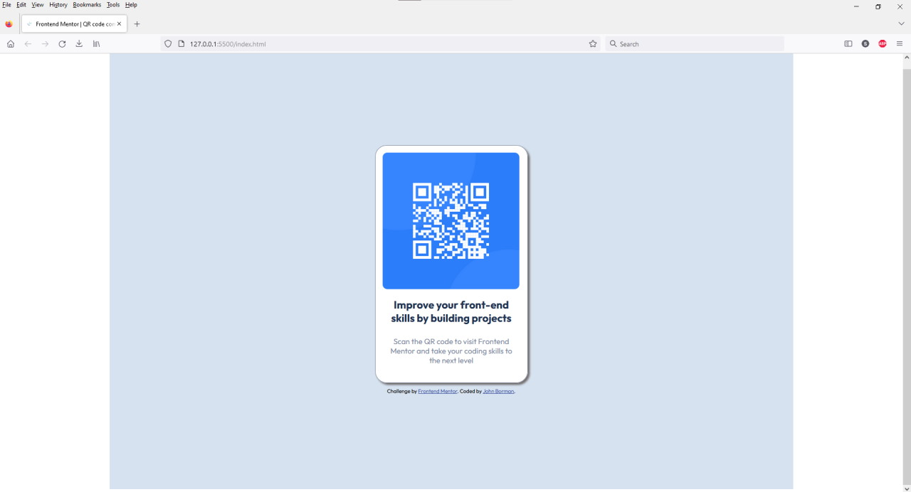

# Frontend Mentor - QR code component solution

This is a solution to the [QR code component challenge on Frontend Mentor](https://www.frontendmentor.io/challenges/qr-code-component-iux_sIO_H). Frontend Mentor challenges help you improve your coding skills by building realistic projects. 

## Table of contents

- [Overview](#overview)
  - [Screenshot](#screenshot)
  - [Links](#links)
- [My process](#my-process)
  - [Built with](#built-with)
  - [What I learned](#what-i-learned)
  - [Continued development](#continued-development)
  - [Useful resources](#useful-resources)
- [Author](#author)
- [Acknowledgments](#acknowledgments)

## Overview

### Screenshot

### Links

- Solution URL: [Add solution URL here](https://your-solution-url.com)
- Live Site URL: [Add live site URL here](https://your-live-site-url.com)

## My process

### Built with

- HTML5
- CSS3

### What I learned

- This was a simple and basic layout using HTML and CSS. And learning that is important, as understanding and creating the simple basic building blocks is the proper start to any Website.

- Learning a Workflow is easily one of the first biggest challenges I have unexpectedly run across. A Workflow encompasses many things. Such as:
 - - Settling on a consistent way to Format the code
 - - Deciding on Naming Conventions for files and folders
 - - How to approach the project
 - - What auxillary programs I often use and how to keep them readily available

 I have added a second monitor and found it to be a huge help. For starters it allows me to write code on one screen and view my page in a browser on the other screen. Beats flipping back and forth on the same screen. I would highly recommend another monitor if your finances, computer, and space allow it.
 
### Continued development

- A big challenge I need to overcome is to quit 'copying and pasting code' and to actually write the code in place when and where as needed.

## Author

- Website - [John Borman](https://madartistphoto.github.io/Landing-Page/)
- Frontend Mentor - [MadArtistPhoto](https://www.frontendmentor.io/profile/MadArtistPhoto)

## Acknowledgments

